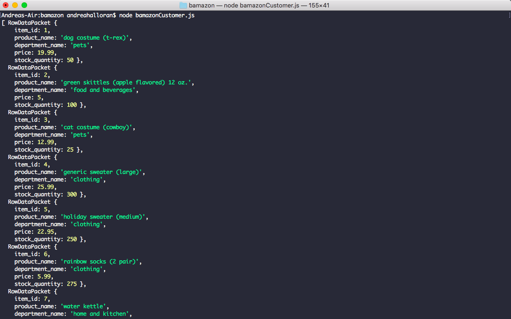

1.	Introduction
Bamazon is an Amazon like storefront CLI app.

Upon opening, the app will display all of the items that are for sale from the store.

The user can select an item to purchase by selecting the item_id. After making a selection, the user will be prompted to select how many of the item they would like to purchase.
If the product is available, the app will console.log: "** scanning shopping cart**" This will return the total price of the purchase and display the remaining stock left for the product. The remaining stock will be updated in the SQL database. 
If the quantity requested to buy is more than what is available in the database, the user will be told: "I'm sorry, we do not have enough product in stock."

2.	Technology Used
o	MySQL and Inquirer npm packages
o	MySQL
o	JavaScript
o	node.js

